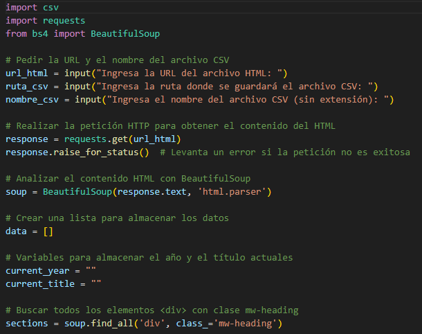
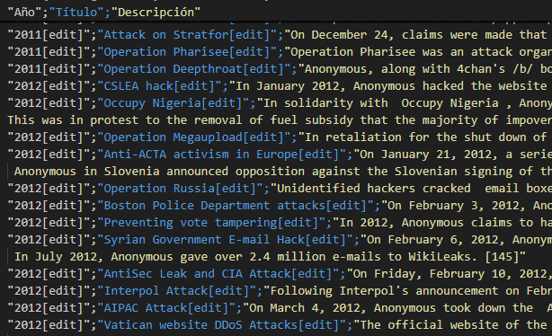
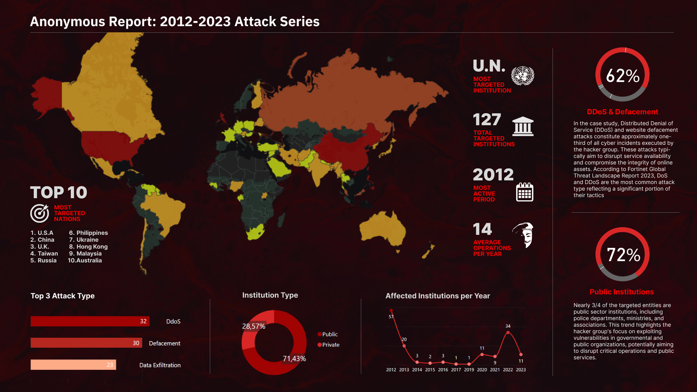
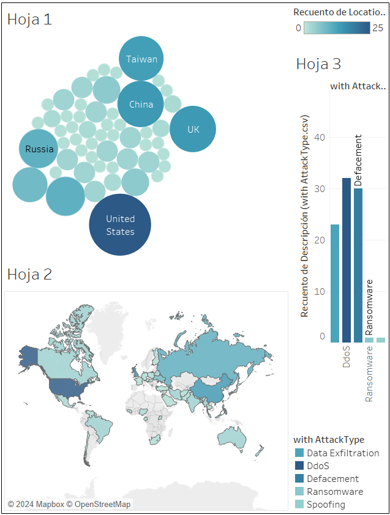

# Anonymous Report: 2012-2023 attack series

&nbsp;

# Executive Summary

**1. Introduction**
- Case Scenario
- Scope
- Objective
- Results
&nbsp;

**2. Methodology**
- Data Collection
- Data Wrangling
- Visualization
&nbsp;

**3. Results**
- Visualization
- Key Insights
&nbsp;

**4. Conclusion**
- Achievements
- Recommendations
&nbsp;

**5. Appendix**
- Code and Tools
- Sample Data
- Additional Visualizations

&nbsp;

# 1. Introduction
## Case Scenario.

A prestigious Cyber Threat Intelligence (CTI) consultancy has requested a Data Analysis report on **attacks attributed to the hacker group Anonymous** between 2012 and 2023. This analysis will provide a retrospective view of the group's activities and help identify patterns, techniques, and preferred targets.

As a data analyst, my task is to delve into this decade of hacking activity, unraveling the complex web of Anonymous's operations. I must gather, process, and analyze data from multiple sources, looking for trends, anomalies, and evolutions in their attack methods. This report will be crucial for organizations to better understand the threats they face and strengthen their defenses against similar future attacks.

- **Scope**: The primary goal was to analyze attacks attributed to Anonymous, understanding patterns and implications for improved cyber defense strategies.
- **Objective**: To identify recurring techniques, targeted entities, and geographical trends, offering actionable insights for cybersecurity practitioners.
- **Results**: A clean, structured dataset and visualizations revealing critical insights into Anonymous' activities over a decade.

&nbsp;

# 2. Methodology
## Data Collection
- **Technique**: Gathering data from publicly available sources through **web scraping**.
- **Tool**: A Python script, `Anon_wikiScraper.py`, was developed to extract structured information, including dates, descriptions, and attack targets. The script produced the first CSV file containing raw data for further processing (Draft_AnonymousAttacks.csv).

&nbsp;

 *Code snippet from web_scraper.py:*
 &nbsp;

&nbsp;

*Screenshot from the first .csv results:*
&nbsp;

## Data Wrangling
To ensure high-quality analysis, the dataset underwent extensive processing:

- **Scripts Used**: Python scripts like `csv_cleaner.py` were used to eliminate irrelevant characters and out-of-range data.
- **Enhancements**: Additional columns, such as "Location" and "Attack Type," were integrated using data dictionaries and `csv_columns.py`.
- **Duplicate Removal**: A custom script, `splitter3.py`, was employed to handle duplicate entries and refine multi-location entries.

## Visualization

The cleaned data was structured to be compatible with popular visualization tools such as Tableau and PowerBI. Ensuring proper formatting was key to accurate and insightful visual representation.

Data visualizations were created on **PowerBI** to highlight key trends and insights, leveraging trends and metrics related to attack patterns.

&nbsp;

# 3. Results
## Visualizations
The project yielded interactive and static visualizations that revealed:

- **PowerBI**: Demonstrated temporal trends and the frequency of various attack types.
- **Tableau**: Mapped attack locations and identified hot zones for Anonymous’ activities.

## Key Insights
The analysis uncovered:

- Clear geographical patterns in targeted regions.
- Frequent techniques and tools employed by Anonymous.
- Strategic patterns suggesting evolution in their operational methods over the decade.

&nbsp;

*PowerBI Dashboard*

&nbsp;

*Creating Tableau Dashboard*

&nbsp;

# 4. Conclusion

## Achievements
- Successfully created a structured dataset from unstructured web data.
- Delivered actionable insights through detailed analysis and visualization.
- Provided a framework for continuous monitoring and analysis of hacker activities.

## Recommendations
- Organizations should adopt real-time data scraping and analysis to stay ahead of emerging threats.
- Cyber defenses should be tailored to counteract the identified patterns and methods of Anonymous.

---

&nbsp;

# Appendix

### Code and Tools
- Python scripts used:
  - `Anon_wikiScraper.py`: For web scraping.
  - `csv_cleaner.py`: For cleaning HTML artifacts.
  - `csv_columns.py`: For adding structured data.

### Sample Data
A sample of the formatted dataset is available, showcasing columns such as Date, Description, Location, and Attack Type.

### Additional Visualizations
Detailed screenshots of PowerBI and Tableau dashboards are included to illustrate the visual insights derived from the analysis.